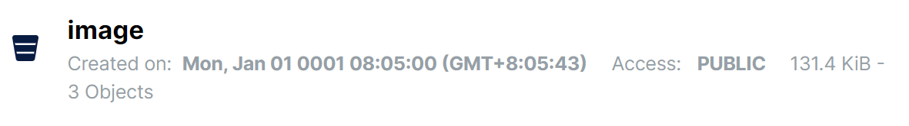
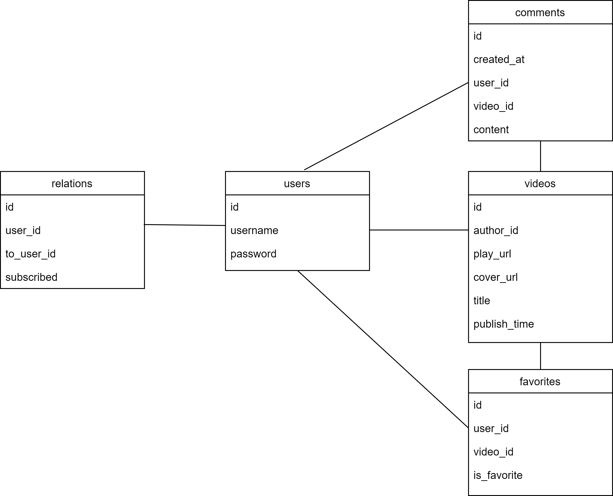

# tiktok-demo
## 1.安装部署
1. 安装mysql，执行sql文件
2. 安装nginx，根据项目中conf/nginx.conf修改nginx.conf配置文件，重新启动
3. 安装minio，建议默认9000端口，创建两个桶image和video，公开访问权限

4. 安装ffmpeg，linux上将可执行文件配置到/usr/bin中，windows配置环境变量
5. 下载代码，go mod tidy拉取第三方库
6. 修改conf/config.yaml参数适配

## 2.数据库设计

